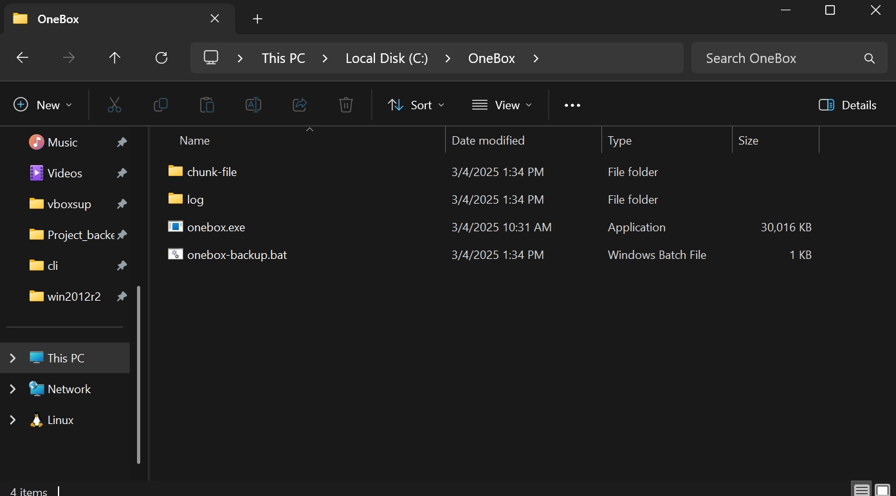
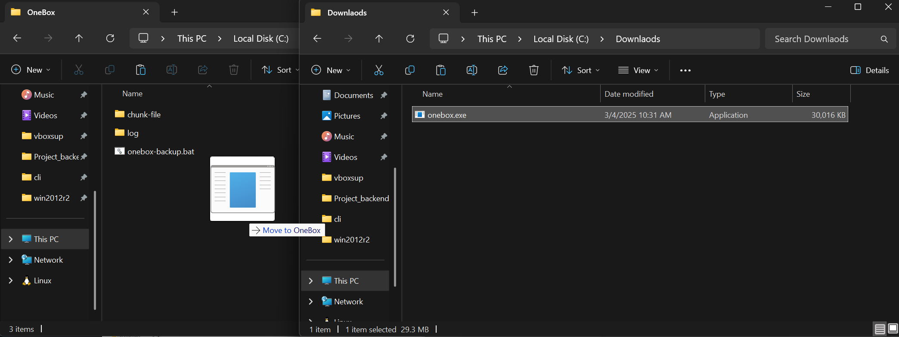
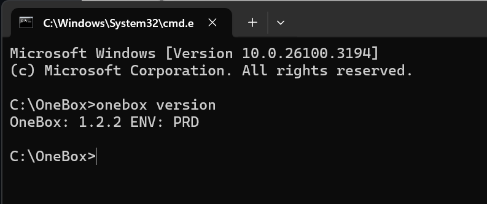
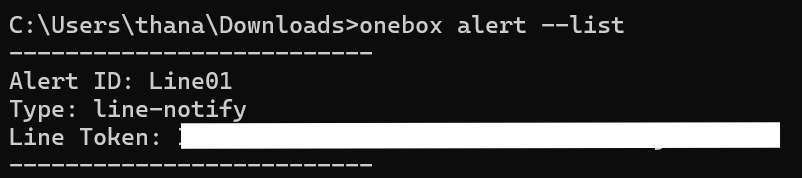
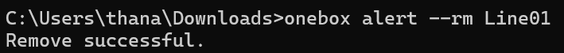
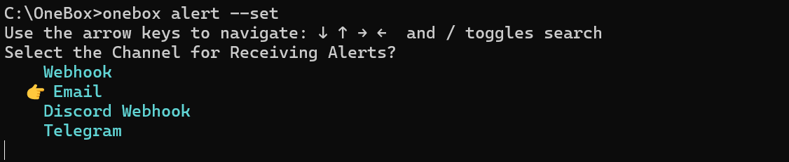
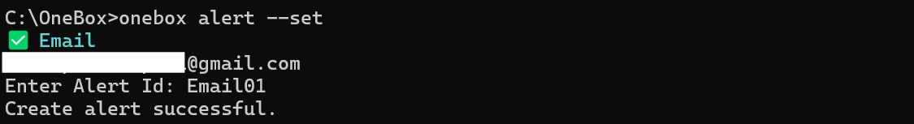
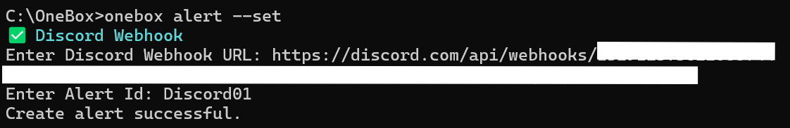
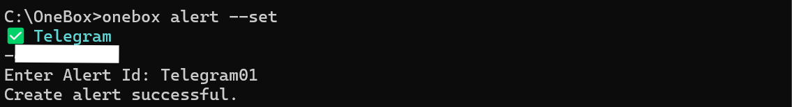
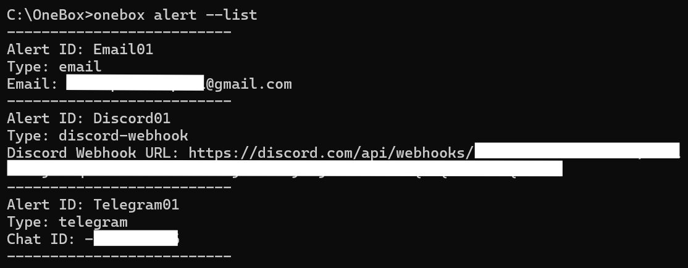

# การตั้งค่า Notify OneBox CLI (เวอร์ชั่น 1.2.2 ขึ้นไป)

## 1. ดาวน์โหลดไฟล์โปรแกรมเวอร์ชั่นล่าสุด

ดาวน์โหลดไฟล์ OneBox สำหรับ Windows

[คลิกเพื่อ download สำหรับ Windows](https://github.com/kla7016/onebox-cli/releases/latest/download/onebox.exe)

ดาวน์โหลดไฟล์ OneBox สำหรับ Linux
```bash
sudo wget https://github.com/kla7016/onebox-cli/releases/latest/download/onebox -O /usr/local/bin/onebox
```

ให้สิทธิ์ในการรันไฟล์ OneBox สำหรับ Linux
```bash
sudo chmod +x /usr/local/bin/onebox
```


## 2. เปิดโฟลเดอร์ที่เก็บไฟล์ onebox.exe เดิม



## 3. ลบไฟล์โปรแกรมเดิม แล้วแทนที่ด้วยโปรแกรมเวอร์ชั่นล่าสุด



## 4.เปิด command prompt และตรวจสอบเวอร์ชั่นโปรแกรม

```bash
onebox version
```
โปรแกรมต้อง version เท่ากับหรือมากกว่า 1.2.2



## 5. ตรวจสอบการตั้งค่า Notify
### 5.1 พิมพ์คำสั่งสำหรับตรวจสอบการตั้งค่า Notify ทั้งหมด
```bash
onebox alert --list
```
ระบบจะแสดง Notify ที่เราตั้งค่าทั้งหมด

 <br>

### 5.2 ลบ Notify ประเภท line-notify ด้วย Alert ID (หากมี)



### 5.3 พิมพ์คำสั่งสำหรับตั้งค่า Notify

```bash
onebox alert --set
```
<br>
Notify ที่เพิ่มมาจะมี Email, Discord Webhook และ Telegram
<br>

<br><br>
Email - กรอก Email ที่ต้องการส่งแจ้งเตือน Backup
<br>

<br><br>
Discord Webhook - กรอก URL Discord Webhook ที่ต้องการส่งแจ้งเตือน Backup



สามารถตรวจสอบ URL Discord Webhook ผ่าน [คู่มือการตั้งค่าการแจ้งเตือนสำหรับ Discord Webhook](https://github.com/kla7016/onebox-cli?tab=readme-ov-file#%E0%B8%81%E0%B8%B2%E0%B8%A3%E0%B8%95%E0%B8%B1%E0%B9%89%E0%B8%87%E0%B8%84%E0%B9%88%E0%B8%B2%E0%B8%81%E0%B8%B2%E0%B8%A3%E0%B9%81%E0%B8%88%E0%B9%89%E0%B8%87%E0%B9%80%E0%B8%95%E0%B8%B7%E0%B8%AD%E0%B8%99%E0%B8%AA%E0%B8%B3%E0%B8%AB%E0%B8%A3%E0%B8%B1%E0%B8%9A-Discord-Webhook)

<br>
Telegram - กรอก Chat ID ที่ต้องการส่งแจ้งเตือน Backup<br>


สามารถตรวจสอบ Chat ID ผ่าน [คู่มือการตั้งค่าการแจ้งเตือนสำหรับ Telegram](https://github.com/kla7016/onebox-cli?tab=readme-ov-file#%E0%B8%81%E0%B8%B2%E0%B8%A3%E0%B8%95%E0%B8%B1%E0%B9%89%E0%B8%87%E0%B8%84%E0%B9%88%E0%B8%B2%E0%B8%81%E0%B8%B2%E0%B8%A3%E0%B9%81%E0%B8%88%E0%B9%89%E0%B8%87%E0%B9%80%E0%B8%95%E0%B8%B7%E0%B8%AD%E0%B8%99%E0%B8%AA%E0%B8%B3%E0%B8%AB%E0%B8%A3%E0%B8%B1%E0%B8%9A-Telegram)


### 5.4 พิมพ์คำสั่งสำหรับตรวจสอบการตั้งค่า Notify ทั้งหมดอีกครั้ง
```bash
onebox alert --list
```



หากข้อมูลถูกต้องแล้วถือว่าการตั้งค่าการแจ้งเตือนเสร็จสิ้น